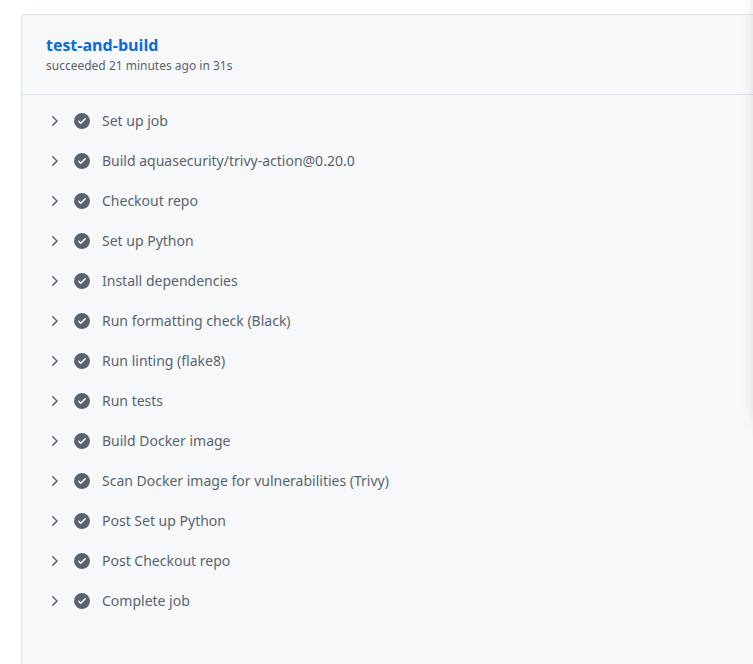

# DevOps CI/CD Demo (Flask + Docker + GitHub Actions)

This project demonstrates a production-style DevOps workflow:

- Flask API service
- Dockerized deployment artifact
- Automated CI pipeline (tests + build)

---

## DevSecOps Features

This pipeline includes:

- Automated testing with pytest
- Code quality gates with Black + flake8
- Docker image builds on push
- Vulnerability scanning with Trivy
- Container publishing to GHCR

---

## Endpoints

- `GET /health` → service health check  
- `GET /version` → version metadata

---

## Local Setup

```bash
python3 -m venv venv
source venv/bin/activate
pip install -r requirements.txt
```

---

## Local Development

### Run tests
```bash
make test
```
### Build container
```bash
make build
```
### Run container
```bash
make run
```

Then open:

http://localhost:8080/health

---

## Maintenance Automation

This repository uses Dependabot to automatically:

- Keep Python dependencies up to date
- Track GitHub Actions version updates
- Generate PRs for security and patch upgrades

---

## Pipeline Example

